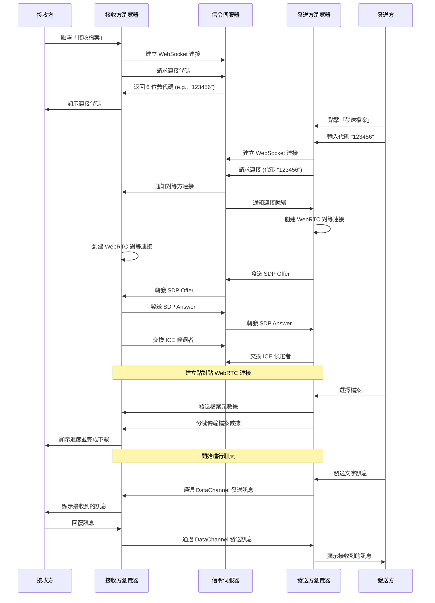

# ezTransfer - P2P 檔案傳輸 Web App

一個基於 WebRTC 的點對點檔案傳輸 Web 應用程式，使用 Nuxt.js (Vue.js) 作為前端，FastAPI 作為信令伺服器。無需註冊，無需安裝，只需瀏覽器即可在設備之間安全地傳輸檔案。


## 🚀 主要特點

* 🔒 **點對點加密傳輸** - 檔案直接從一個設備傳輸到另一個設備，不經過雲端伺服器
* 📱 **跨裝置相容性** - 支援所有主流瀏覽器和裝置（電腦、手機、平板）
* 🔑 **簡單的 6 位數代碼配對** - 簡單的配對過程，無需註冊帳號
* 📁 **無檔案大小限制** - 只受限於裝置記憶體和網路速度
* ⚡ **快速傳輸** - 直接連接兩個裝置之間，最大化傳輸速度
* 💬 **即時聊天功能** - 支援檔案傳輸時的即時文字通訊
* 🛠️ **簡單容器化部署** - 使用 Docker 和 Docker Compose 輕鬆部署

## 📋 技術堆疊

*   **前端:**
    *   框架: Nuxt.js 3 (Vue.js)
    *   UI: Bootstrap 5 + Bootstrap Icons
    *   核心: WebRTC API (瀏覽器內建)
    *   狀態管理: Pinia
    *   通訊: WebSocket
*   **後端 (信令伺服器):**
    *   框架: FastAPI (Python)
    *   伺服器: Uvicorn
    *   通訊: WebSockets
    *   安全性: HMAC 令牌驗證
*   **NAT 穿透:**
    *   STUN 伺服器: Google 公開 STUN (`stun:stun.l.google.com:19302`)
    *   TURN 伺服器: 可選配置，使用環境變數設定
*   **容器化:**
    *   Docker, Docker Compose
    *   Traefik 反向代理 (生產環境)

## 🏗️ 專案結構

```
ezTransfer-vue/
├── frontend/           # Nuxt.js 前端專案
│   ├── app.vue         # Nuxt 應用入口點
│   ├── nuxt.config.ts  # Nuxt 配置檔
│   ├── components/     # Vue 元件
│   │   ├── ChatInterface.vue   # 聊天介面元件
│   │   ├── ChatWindow.vue      # 聊天視窗元件
│   │   └── ...                 # 其他介面元件
│   ├── lib/
│   │   ├── webrtc.js     # WebRTC 連接管理
│   │   ├── signaling.js  # WebSocket 信令客戶端
│   │   └── fileHandler.js # 檔案處理邏輯
│   ├── pages/          # 應用頁面
│   │   └── chat-popup.vue # 聊天彈出視窗頁面
│   ├── stores/         # Pinia 狀態管理
│   │   ├── connection.js  # WebRTC 連接狀態
│   │   ├── chat.js        # 聊天功能狀態
│   │   └── ...
│   ├── services/       # 服務層
│   │   ├── MessageService.js   # 訊息處理服務
│   │   └── WindowSyncService.js # 跨視窗同步
│   ├── assets/         # 靜態資源
│   ├── public/
│   │   ├── logo.svg       # 應用程式標誌
│   │   └── favicon.svg    # 網站圖標
│   ├── Dockerfile      # 前端 Dockerfile
│   └── package.json    # 依賴和腳本
├── backend/            # FastAPI 後端 (信令伺服器)
│   ├── app/
│   │   ├── __init__.py
│   │   ├── main.py              # FastAPI 應用與 WebSocket 端點
│   │   ├── connection_manager.py # WebSocket 連接管理
│   ├── Dockerfile      # 後端 Dockerfile
│   └── requirements.txt
├── test/               # 測試配置目錄
│   └── docker-compose.yml # 測試環境配置
├── docker-compose.yml  # Docker Compose 生產配置
├── .env.example        # 環境變數範例配置
└── README.md           # 本文件
```

## 📊 使用者流程



## 🔄 核心功能和工作流程

### WebRTC 連接建立流程

1. **初始連接**:
   - 接收方請求 6 位數代碼 (`RequestCode`)
   - 信令伺服器生成並返回代碼
   - 傳送方輸入 6 位數代碼 (`RequestConnection`)
   - 信令伺服器驗證代碼並配對連接

2. **信令交換**:
   - WebRTC 要求交換 SDP 和 ICE 候選者以建立連接
   - 發送方建立 Offer，通過信令伺服器傳送
   - 接收方接收 Offer，建立 Answer，通過信令伺服器傳送
   - 雙方交換 ICE 候選者，找到最佳連接路徑

3. **點對點連接**:
   - 一旦 ICE 連接建立，數據通道打開
   - 雙方可以直接傳輸數據，無需經過伺服器

### 檔案傳輸流程

1. **檔案選擇與準備**:
   - 傳送方選擇要傳輸的檔案
   - `FileHandler` 建立檔案隊列，計算總大小
   - 將檔案資訊發送給接收方

2. **檔案傳輸處理**:
   - 自適應分塊: 根據網路情況調整分塊大小 (16KB 到 256KB)
   - 流量控制: 監控並限制數據通道緩衝區大小
   - 進度追蹤: 實時更新單檔案和整體隊列進度
   - 性能監控: 記錄傳輸速度、瓶頸並自適應調整參數

3. **控制功能**:
   - 暫停/恢復: 允許中斷和恢復傳輸過程
   - 取消: 可以取消整個傳輸或隊列中的特定檔案
   - 重試: 處理失敗情況的重試機制

### 聊天功能

1. **即時通訊**:
   - 通過相同的 WebRTC 數據通道實現文字聊天
   - 支援多視窗同步 (主視窗和彈出視窗)
   - 提供 Markdown 格式和表情符號支援

2. **UI 元素**:
   - 可最小化/最大化的聊天介面
   - 未讀消息計數
   - 支援獨立彈出視窗模式

## 💻 前端架構

### 核心組件

1. **WebRTC 通信層** (`lib/webrtc.js`):
   - 管理 RTCPeerConnection 和 RTCDataChannel
   - 處理 STUN/TURN 配置和 ICE 候選者
   - 提供連接狀態管理和事件回調

2. **信令客戶端** (`lib/signaling.js`):
   - 與後端 WebSocket 伺服器通信
   - 實現安全的令牌驗證機制
   - 管理信令訊息的發送和接收

3. **檔案處理器** (`lib/fileHandler.js`):
   - 完整的檔案傳輸管理系統
   - 多檔案隊列處理和進度追蹤
   - 自適應優化和性能監控

### 狀態管理

1. **連接狀態** (`stores/connection.js`):
   - 使用 Pinia 管理 WebRTC 連接狀態
   - 處理角色分配 (接收方/發送方)
   - 提供連接生命週期管理

2. **聊天狀態** (`stores/chat.js`):
   - 管理聊天訊息和界面狀態
   - 實現跨視窗同步
   - 處理未讀消息計數和通知

### UI 架構

1. **主組件**:
   - 檔案傳輸介面和控制項
   - 連接狀態指示器和配對流程
   - 聊天介面的整合

2. **聊天組件** (`components/ChatInterface.vue`, `components/ChatWindow.vue`):
   - 可最小化/最大化的聊天視窗
   - Markdown 渲染與 XSS 防護
   - 表情符號選擇器和格式輔助

## 🖥️ 後端架構

### FastAPI 應用

1. **主應用** (`main.py`):
   - 定義 WebSocket 端點
   - 實現 CORS 和安全頭
   - 提供令牌生成 API

2. **連接管理器** (`connection_manager.py`):
   - 管理活躍的 WebSocket 連接
   - 生成並驗證 6 位數連接代碼
   - 處理連接配對和訊息路由

### 安全特性

1. **WebSocket 令牌驗證**:
   - 使用 HMAC 驗證確保連接安全
   - 時間戳和過期時間驗證
   - 防止未授權連接

## 🛠️ 開發步驟

1.  **環境設置：** 初始化 Nuxt.js 和 FastAPI 專案，安裝依賴。
2.  **後端信令伺服器 (FastAPI)：**
    *   建立 WebSocket 端點 (`/ws` 或類似)。
    *   實作 `ConnectionManager` 來處理：
        *   新連接加入。
        *   為接收方生成並儲存 6 位數代碼。
        *   處理傳輸方的代碼驗證與配對。
        *   在配對的客戶端之間轉發 Offer, Answer, ICE 候選者訊息。
        *   處理連接斷開。
3.  **前端基礎 (Nuxt.js)：**
    *   設計基本 UI 組件：
        *   「接收檔案」按鈕。
        *   「傳輸檔案」按鈕。
        *   代碼顯示區域。
        *   代碼輸入框。
        *   檔案選擇輸入框 (隱藏，由按鈕觸發)。
        *   狀態/進度顯示區域。
    *   整合 Bootstrap 樣式。
4.  **前端信令客戶端 (`lib/signaling.js`)：**
    *   建立 `SignalingClient` 類。
    *   方法：`connect()`, `disconnect()`, `requestCode()`, `requestConnection(code)`, `sendOffer(offer)`, `sendAnswer(answer)`, `sendIceCandidate(candidate)`。
    *   事件回調：`onCodeGenerated(code)`, `onConnectionReady()`, `onPeerConnected()`, `onOfferReceived(offer)`, `onAnswerReceived(answer)`, `onIceCandidateReceived(candidate)`, `onError(error)`.
5.  **前端 WebRTC 核心 (`lib/webrtc.js`)：**
    *   建立 `WebRTCManager` 類。
    *   方法：`createPeerConnection(signalingClient)`, `createDataChannel()`, `sendOffer()`, `sendAnswer()`, `addIceCandidate(candidate)`, `sendFile(file)`.
    *   事件回調：`onDataChannelOpen()`, `onDataChannelMessage(data)`, `onDataChannelClose()`, `onConnectionStateChange(state)`.
    *   整合 STUN 伺服器配置。
6.  **前端檔案處理 (`lib/fileHandler.js`)：**
    *   檔案分塊、傳輸和組裝方法
    *   檔案隊列管理
    *   進度跟踪和狀態回調
7.  **整合與 UI 細化：**
    *   在 Pinia store 中管理連接和檔案傳輸狀態
    *   使用 Vue 組件處理 UI 更新和事件
    *   加入錯誤處理和用戶提示
8.  **測試：** 本地運行前後端，在兩個瀏覽器分頁中測試完整的一對一傳輸流程。

## 🐳 Docker 支援

### 環境變數配置

複製 `.env.example` 到 `.env` 檔案在專案根目錄下，配置以下環境變數：

```env
# 前端環境變數配置
# 複製此文件到 .env 並根據需要修改

# 信令伺服器 WebSocket URL
NUXT_PUBLIC_SIGNALING_URL=ws://localhost:8000/ws

# WebSocket Token API 端點
NUXT_PUBLIC_WS_TOKEN_ENDPOINT=/api/get-ws-token

# WebSocket 安全密鑰 (用於認證)
NUXT_PUBLIC_WSS_KEY=your_wss_key_here
WSS_KEY=your_wss_key_here


# STUN/TURN 伺服器配置 (用於 NAT 穿透)
NUXT_PUBLIC_STUN_URI=stun:stun.l.google.com:19302
NUXT_PUBLIC_TURN_URI=turn-uri
NUXT_PUBLIC_TURN_USERNAME=turn-username
NUXT_PUBLIC_TURN_PASSWORD=turn-password
NUXT_PUBLIC_TURN_PROTO=udp

# 連接配置
NUXT_PUBLIC_CONNECTION_TIMEOUT=10000

# 檔案傳輸配置
NUXT_PUBLIC_CHUNK_SIZE=16384

# 開發模式配置
NUXT_PUBLIC_DEV_MODE=false

# 後端配置
# 後端使用的安全密鑰 (用於 JWT 簽名)
SECRET_KEY=your_jwt_key_here
# 後端允許的 CORS 原始域名 (逗號分隔)
CORS_ALLOW_ORIGINS="https://your-frontend.domain1,https://your-frontend.domain2"
```

### 前端 Dockerfile (`frontend/Dockerfile`)

```Dockerfile
# 階段 1: 構建應用
FROM node:23-alpine AS builder
WORKDIR /app

# 複製依賴相關文件
COPY package*.json ./
RUN npm install

# 複製所有文件
COPY . .

# 構建應用
RUN npm run build


# 階段 2: 生產環境
FROM node:23-alpine
WORKDIR /app

# 從構建階段複製必要文件
COPY --from=builder /app/node_modules ./node_modules
COPY --from=builder /app/.output ./.output
COPY --from=builder /app/package.json ./package.json

# 環境變數
ARG NODE_ENV_ARG=${NODE_ENV_ARG_COMPOSE}
ENV NODE_ENV=${NODE_ENV_ARG}

# 開放端口
EXPOSE 3000

# 使用啟動腳本運行應用
CMD ["node", ".output/server/index.mjs"]
```

### 後端 Dockerfile (`backend/Dockerfile`)

```Dockerfile
# 使用 Python 3.12 slim 作為基礎映像
FROM python:3.12-slim

# 設定工作目錄
WORKDIR /app

# 將 requirements.txt 複製到工作目錄
COPY requirements.txt requirements.txt

# 更新 pip 並安裝 requirements.txt 中定義的依賴
# 使用 --no-cache-dir 減少映像大小
RUN pip install --no-cache-dir --upgrade pip && \
    pip install --no-cache-dir -r requirements.txt

# 將 backend/app 目錄下的所有內容複製到容器的 /app/app 目錄
# 注意：這裡假設您的 FastAPI 程式碼位於 backend/app/ 目錄下
COPY ./app /app/app

# 開放 FastAPI/Uvicorn 預設使用的 8000 埠
EXPOSE 8000

# 容器啟動時執行的命令
# 啟動 Uvicorn 伺服器，監聽所有網路介面 (0.0.0.0) 的 8000 埠
# 指向 app.main 模組中的 app 物件
# 在開發環境中，docker-compose.yml 的 volumes 會掛載本地程式碼，
# 可以加上 --reload 參數讓 Uvicorn 自動重載程式碼變更
# CMD ["uvicorn", "app.main:app", "--host", "0.0.0.0", "--port", "8000", "--reload"]
# 生產環境不建議使用 --reload
CMD ["uvicorn", "app.main:app", "--host", "0.0.0.0", "--port", "8000"]
```

### Docker Compose (`docker-compose.yml`)

實際 docker-compose.yml 配置另外使用 Traefik 作為反向代理，並設定了網路、標籤和環境變數。

## 🚀 部署與運行

### 開發環境

1. 克隆儲存庫：
   ```bash
   git clone https://github.com/valorvie/ezTransfer-vue.git
   cd ezTransfer-vue
   ```

2. 安裝前端依賴：
   ```bash
   cd frontend
   npm install
   ```

3. 安裝後端依賴：
   ```bash
   cd ../backend
   python -m venv venv
   source venv/bin/activate  # On Windows: venv\Scripts\activate
   pip install -r requirements.txt
   ```

4. 在開發模式下分別運行前後端：
   - 後端：
     ```bash
     cd backend
     python -m uvicorn app.main:app --reload --host 0.0.0.0 --port 8000
     ```
   - 前端：
     ```bash
     cd frontend
     npm run dev
     ```

5. 前端網站將在 `http://localhost:3000` 可用。

### 生產環境 (使用 Docker)

1. 複製 `.env.example` 到 `.env` 並設定環境變數：
   ```bash
   cp .env.example .env
   # 編輯 .env 文件設定環境變數
   ```

2. 使用 Docker Compose 構建並啟動服務：
   ```bash
   docker-compose up -d --build
   ```

3. 服務將在 `https://your-frontend-domain` 可用（假設您在 Traefik 中配置了相應的域名）。

## 📝 注意事項

1. **瀏覽器支援**：本應用支援所有現代瀏覽器，包括 Chrome, Firefox, Safari, Edge 等。
2. **NAT 穿透**：雖然使用了 STUN 伺服器幫助穿透 NAT，但是在某些網路環境下（如對稱型 NAT）可能需要 TURN 伺服器支援。
3. **安全性**：
   - 所有資料傳輸都是點對點的，不會經過伺服器。
   - WebRTC 資料通道是加密的。
   - 信令伺服器應該使用 WSS (WebSocket Secure) 連接。

## 📜 授權條款

本專案遵循 MIT 授權條款。

## 🤝 貢獻

歡迎提出問題、功能請求以及提交 Pull Request！

## 🔧 部署架構

### Docker 容器化

1. **前端容器**:
   - 基於 Node.js Alpine 優化體積
   - 採用多階段構建提升安全性
   - 支援環境變數配置

2. **後端容器**:
   - 基於 Python 3.12 slim
   - 使用 Uvicorn ASGI 伺服器
   - 優化依賴管理

### 網路配置

1. **Traefik 整合**:
   - 自動 HTTPS 和憑證管理
   - 路由和標籤設定
   - 容器更新策略

## ✨ 未來計劃

- [x] 移動應用適配優化
- [x] 多檔案同時傳輸支援
- [x] 新增文件/資料夾拖放支援
- [x] 即時聊天功能
- [ ] 傳輸歷史記錄
- [ ] 端到端加密聊天
- [ ] 進一步增強使用者界面和體驗
- [ ] 國際化支援 (i18n)

