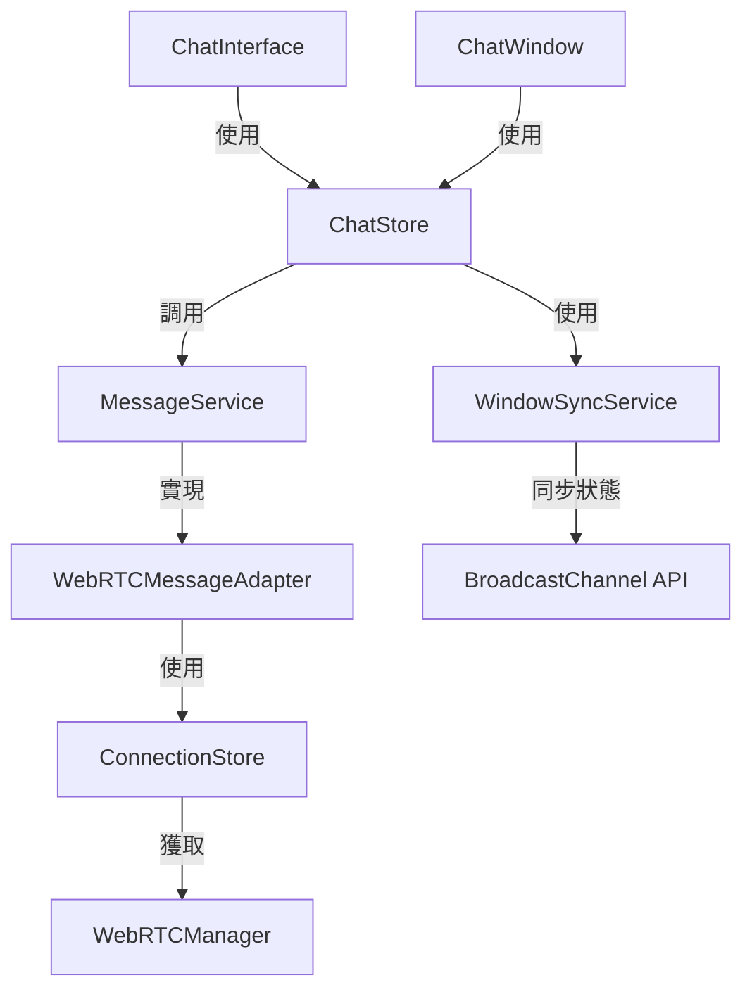

# ezTransfer 聊天功能架構文檔

本文檔說明了 ezTransfer 聊天功能的架構設計和使用方法，特別是新的跨窗口交互聊天功能。

## 架構概述

新的聊天架構採用了模組化設計，將消息傳輸邏輯與業務邏輯分離，並實現了跨窗口狀態同步：



### 主要組件

1. **MessageService**: 消息服務抽象層
   - 定義了消息收發的標準接口
   - 實現了 WebRTC 消息適配器
   - 允許未來擴展其他通信方式

2. **WindowSyncService**: 跨窗口狀態同步服務
   - 使用 BroadcastChannel API 實現窗口間通信
   - 提供降級方案，支持不支持 BroadcastChannel 的瀏覽器
   - 同步聊天消息、未讀數量和視圖狀態

3. **ChatStore**: 重構的聊天狀態管理
   - 使用消息服務發送/接收消息
   - 管理聊天消息和狀態
   - 處理跨窗口同步

4. **ChatWindow**: 可重用的聊天窗口組件
   - 可在主頁面和彈出窗口中使用相同的組件
   - 支持獨立關閉窗口

## 使用方法

### 在主頁面使用聊天功能

主頁面中的聊天功能使用 `ChatInterface` 組件，它會自動初始化聊天功能：

```html
<ChatInterface />
```

### 在新窗口開啟聊天

點擊聊天界面右上角的彈出按鈕即可在新窗口中開啟聊天功能。新窗口將自動與主窗口同步聊天狀態。

### 開發者使用指南

#### 初始化聊天功能

```javascript
import { useChatStore } from '~/stores/chat';

const chatStore = useChatStore();

// 初始化聊天功能，啟用跨窗口同步
chatStore.initChat({
  enableWindowSync: true 
});

// 清理資源
onUnmounted(() => {
  chatStore.cleanup();
});
```

#### 發送和接收消息

```javascript
// 發送消息
const success = chatStore.sendMessage('你好！');

// 監聽消息變化
watch(() => chatStore.messages, (messages) => {
  // 處理消息更新
}, { deep: true });
```

## 構建與部署

聊天功能依賴於特定的構建配置來支持新窗口功能：

1. 在開發環境中運行時，需要執行以下步驟：

```bash
# 安裝依賴
npm install

# 啟動開發服務器
npm run dev
```

2. 在生產環境中構建時：

```bash
# 構建生產版本
npm run build

# 預覽生產版本
npm run preview
```

## 架構優勢

1. **鬆散耦合**：通過抽象層分離了通信邏輯和界面邏輯
2. **跨窗口同步**：支持多窗口實時交互
3. **可擴展性**：支持未來添加其他通信方式（如 WebSocket）
4. **單一職責**：每個組件都有明確的職責範圍
5. **可重用性**：聊天組件可在多個場景下重用

## 已知問題與限制

1. 新窗口加載模式依賴於正確的資產路徑配置
2. 在某些瀏覽器中，彈出窗口可能被拦截，需要用戶授權
3. 如果主窗口關閉，彈出窗口將失去連接

## 未來改進計劃

1. 添加離線消息緩存
2. 支持消息已讀回執
3. 添加文件附件預覽
4. 支持表情符號和 GIF