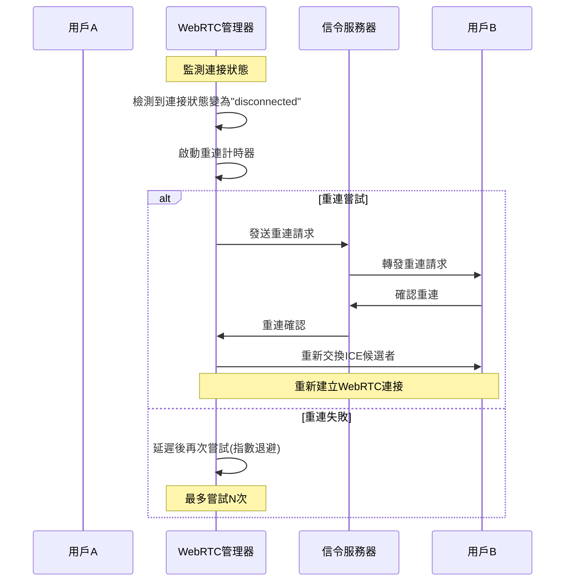
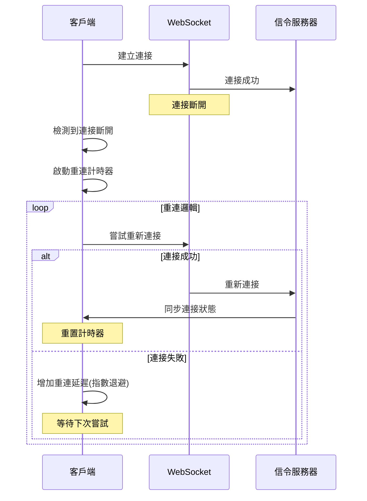
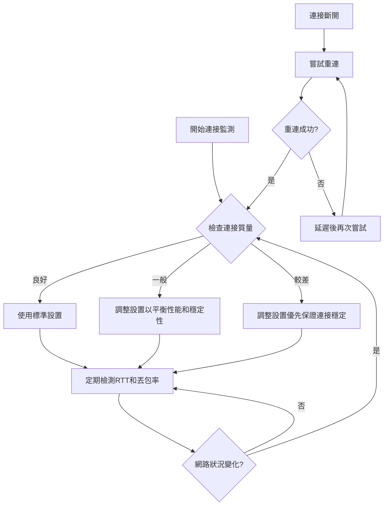
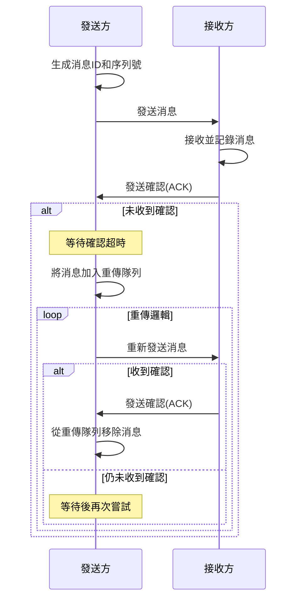

# WebRTC 連接穩定性評估與改進計劃

經過對專案代碼的仔細分析，我已對目前的 WebRTC 連接實現及其在網路不穩定情況下的表現有了全面了解。接下來，我將評估當前狀況並提出改進建議。

## 現有系統評估

### 現有連接機制

目前專案中的 WebRTC 連接建立流程如下：

1. 通過 WebSocket 信令服務器建立初始連接（產生配對碼或輸入配對碼）
2. 交換 WebRTC 所需的 SDP 信息（Offer/Answer）和 ICE 候選者
3. 建立 WebRTC 對等連接和數據通道
4. 通過數據通道傳輸聊天訊息和文件

### 已實現的穩定性措施

1. **基本重傳機制**：
   - 數據通道配置了 `maxRetransmits: 10`（開發模式下為 30）
   - 這確保了單個訊息在發送失敗時會自動嘗試重傳最多 10 次

2. **STUN/TURN 伺服器支持**：
   - 支持配置 STUN 服務器，預設使用 Google 的公共 STUN 服務器
   - 可選配置 TURN 服務器，以應對無法直接連接的情況

3. **連接狀態監控**：
   - 監聽 `iceconnectionstatechange` 和 `connectionstatechange` 事件
   - 當連接狀態變為 'disconnected', 'failed', 或 'closed' 時更新 UI 狀態

4. **消息去重機制**：
   - 使用 `processedMessageIds` 集合記錄已處理的消息 ID
   - 60 秒後自動清理這些 ID 以避免內存無限增長

### 存在的穩定性問題

1. **缺乏自動重連機制**：
   - 當 WebRTC 連接斷開時，系統只是更新狀態，沒有自動嘗試重新建立連接
   - 用戶需要手動重新連接，導致用戶體驗不佳

2. **信令伺服器斷開處理不完善**：
   - WebSocket 連接斷開後沒有自動重連機制
   - 在網路不穩定情況下，可能導致信令通道完全失效

3. **無連接健康監測**：
   - 沒有主動檢測連接質量的機制
   - 沒有在網路環境變差時提前調整參數的策略

4. **消息可靠性保障不足**：
   - 沒有消息確認機制，無法確保訊息一定被對方接收
   - 缺乏分段機制，大型消息在網路不穩定時容易丟失

## 改進計劃

### 1. 實現 WebRTC 連接自動重連機制

具體實現：
- 在 WebRTCManager 類中添加自動重連邏輯
- 實現指數退避算法，避免頻繁重連造成資源浪費
- 設置最大重連次數和總重連時間限制

### 2. 強化信令伺服器連接穩定性

具體實現：
- 在 SignalingClient 類中添加自動重連功能
- 實現心跳機制，主動檢測連接狀態
- 在 WebSocket 的 onclose 事件中觸發重連

### 3. 實現連接健康監測與自適應調整

具體實現：
- 添加連接質量監測邏輯，定期檢查 RTT、丟包率等指標
- 根據網路狀況動態調整 WebRTC 配置參數
- 在連接質量降低時提前採取措施，防止連接斷開

### 4. 增強消息可靠性保障

具體實現：
- 實現消息確認機制(ACK)，確保重要消息被接收
- 添加消息重傳隊列，跟踪未確認的消息
- 對於大型消息或文件傳輸，實現分段傳輸和斷點續傳

## 預期效果

1. **提高連接穩定性**：即使在網路不穩定的情況下，系統也能持續保持連接或在短時間內自動恢復。

2. **改善用戶體驗**：用戶不需要手動重新連接，系統可以在幕後處理連接問題。

3. **增強消息可靠性**：確保所有重要消息都能被對方接收，避免消息丟失。

4. **優化資源使用**：通過自適應調整，在不同網路條件下優化資源使用，既保證連接穩定，又不浪費帶寬。

## 實現優先級

1. **高優先級**：自動重連機制 - 這是解決連接斷開問題的核心
2. **中優先級**：信令伺服器連接穩定性 - 確保能重新建立 WebRTC 連接
3. **中優先級**：消息可靠性保障 - 確保通信不中斷
4. **低優先級**：連接健康監測 - 進一步優化連接質量